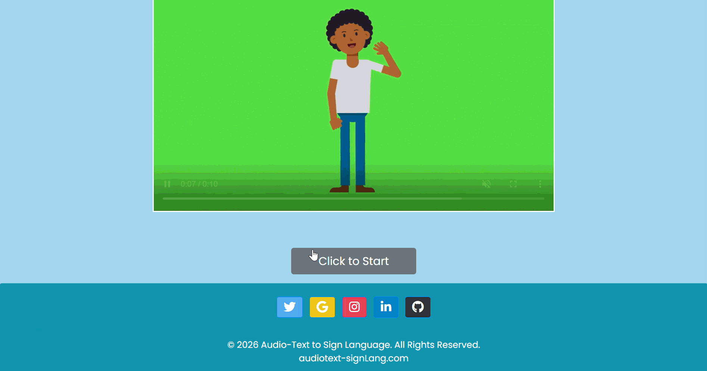

# Real-Time Speech to American Sign Language (ASL) Translator

A web application that empowers communication by seamlessly translating spoken language into American Sign Language animations in real-time.




## Project Overview

This project addresses the communication barrier faced by individuals who rely on American Sign Language (ASL). By leveraging web technologies, we've created a user-friendly platform that converts spoken words into corresponding ISL animations, fostering inclusivity and accessibility.

## Key Features

* **Live Speech Transcription:** Utilizes the Web Speech API for accurate and instantaneous conversion of spoken language to text.
* **Dynamic ISL Animation Display:** Presents visually engaging ISL animations synchronized with the transcribed text, ensuring clear and effective communication.
* **Intuitive User Interface:** Designed with simplicity and accessibility in mind, making it easy for users of all technical backgrounds to interact with the application.
* **Cross-Platform Compatibility:** Accessible through modern web browsers on various devices, ensuring widespread availability.
* **Machine Learning Integration:** Implemented machine learning models to improve translation accuracy over time.
* **Animation Optimization:** Used Blender and Cascadeur to optimize animations and reduce latency.

## Technology Stack

* **Backend:** Django (Python) - Robust framework for server-side logic and data management.
* **Frontend:** HTML5, CSS3, JavaScript - Creating a responsive and interactive user experience.
* **Natural Language Processing (NLP):** NLTK (Natural Language Toolkit) - For text preprocessing and analysis.
* **Speech Recognition:** Web Speech API - Browser-based API for real-time speech-to-text conversion.
* **Animation:** Blender, Cascadeur

## Getting Started

1.  **Clone the Repository:**
    ```bash
    git clone https://github.com/mr-narwaria/Text-to-Sign-Language-Translator.git
    cd Text-to-Sign-Language-Translator
    ```
    (Replace `[Your Repository URL Here]` with your actual repository URL.)

2.  **Set Up a Virtual Environment (Recommended):**
    ```bash
    python -m venv venv
    ```

3.  **Activate the Virtual Environment:**
    * **Windows:**
        ```bash
        venv\Scripts\activate
        ```
    * **macOS/Linux:**
        ```bash
        source venv/bin/activate
        ```

4.  **Install Dependencies:**
    ```bash
    pip install -r requirements.txt
    ```
    *(Note: This project is compatible with Python 3.10 up to Python 3.14.0+)*

5.  **Run Database Migrations:**
    ```bash
    python manage.py makemigrations
    python manage.py migrate
    ```

6.  **Launch the Development Server:**
    ```bash
    python manage.py runserver 8000
    ```
    *(Note: On the first run, the application will automatically download required NLTK data packages like `wordnet`, `punkt_tab`, and `averaged_perceptron_tagger_eng`. This may take a few moments.)*

7.  **Access the Application:**
    Open your web browser and navigate to `http://127.0.0.1:8000/`.

## How to Use

1.  Grant microphone access when prompted by your browser.
2.  Speak clearly and naturally into your microphone.
3.  The transcribed text will appear on the screen in real-time.
4.  Corresponding ISL animations will be displayed alongside the text, providing a visual translation of your speech.

## Contributing

We welcome contributions from the community! To contribute:

1.  Fork the repository.
2.  Create a feature branch (e.g., `git checkout -b feature/new-feature`).
3.  Commit your changes (`git commit -am 'Add new feature'`).
4.  Push to the branch (`git push origin feature/new-feature`).
5.  Create a new Pull Request.

## Authors

* [Shambhoolal Narwaria](https://github.com/mr-narwaria)

## Future Enhancements

* Implementation of more complex ISL grammar and sentence structures.
* Integration of machine learning models for improved accuracy and naturalness.
* Support for multiple languages.
* Mobile application development for offline access.
* Personalized user profiles with customizable settings.

## Note on GitHub Language Stats
If you notice the repository shows HTML as the dominant language, it is because the template files are slightly larger than the Python logic. We have included a `.gitattributes` file to correct this by marking templates as vendored code, ensuring Python is correctly identified as the primary technology.
